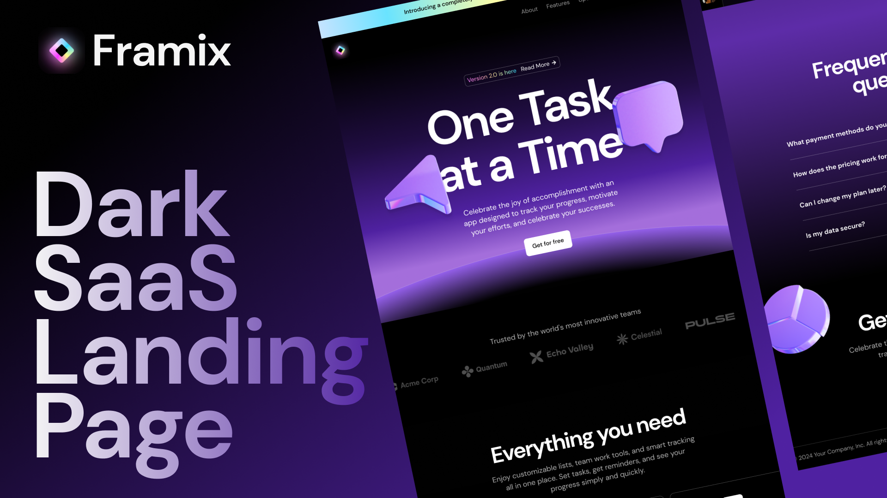

# Framix



Framix is a modern, dark SaaS landing page designed using React, Next.js, TailwindCSS, and Framer Motion. This project aims to provide a fast, responsive, and SEO-optimized landing page that is easy to customize and built with the latest web technologies. This is a Next.js project bootstrapped with create-next-app.

## Features

- Modern, dark design
- Animated with Framer Motion
- Responsive layout
- SEO-optimized
- Cross-Browser Compatibility
- Accessibility
- Easy to Customize

## Getting Started

First, To install the project dependencies, run:

```bash
npm install
# or
yarn install
# or
pnpm install
# or
bun install
```

## Usage

After installation, you can start the development server:

```bash
npm run dev
# or
yarn dev
# or
pnpm dev
# or
bun dev
```

Open [http://localhost:3000](http://localhost:3000) with your browser to see the result.

You can start editing the page by modifying `app/page.tsx`. The page auto-updates as you edit the file.

This project uses [`next/font`](https://nextjs.org/docs/basic-features/font-optimization) to automatically optimize and load DM_Sans, a custom Google Font.

## Design

You can view the design for this project on Figma: [Dark SaaS Landing Page](https://www.figma.com/design/oLXdm2J9jC3TTlYViCYO8a/Dark-SaaS-Landing-Page?m=auto&t=i8XcA7At0mgaXK3A-1)

## Contributing

Contributions are welcome! Please read the [contributing guidelines](CONTRIBUTING.md) first.

## License

This project is licensed under the MIT License. See the [LICENSE](LICENSE) file for details.
